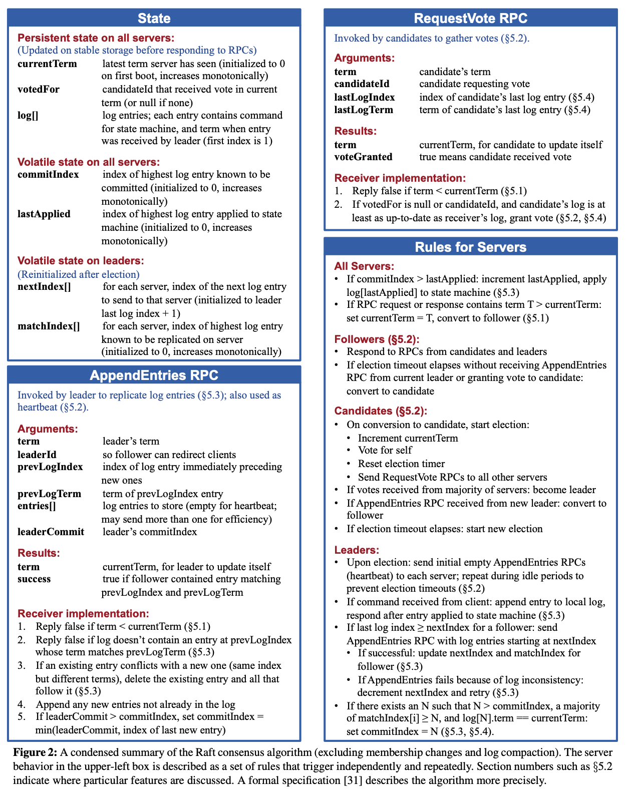

# 6.824: Distributed Systems (MIT)

## Links
- https://pdos.csail.mit.edu/6.824/
- https://pdos.csail.mit.edu/6.824/labs/guidance.html
- Debugging distributed systems: https://blog.josejg.com/debugging-pretty/
- Youtube lectures: https://www.youtube.com/playlist?list=PLrw6a1wE39_tb2fErI4-WkMbsvGQk9_UB
- https://github.com/nsiregar/mit-go

## Grading
Final course grades will be based on:
- 50% labs (programming assignments), including optional project
- 20% mid-term exam
- 20% final exam
- 10% paper question answers and your own questions about papers

## Course Prerequisites
- http://web.mit.edu/6.033/www/index.shtml (operating systems, networking, distributed systems, and security)
- https://pdos.csail.mit.edu/6.828/2022/schedule.html (Operating Systems Engineering)

## Lab 1: Map Reduce
- https://pdos.csail.mit.edu/6.824/labs/lab-mr.html


## Lab 2: Raft
- Raft Paper: <https://pdos.csail.mit.edu/6.824/papers/raft-extended.pdf> or <https://raft.github.io/raft.pdf>
- <https://pdos.csail.mit.edu/6.824/labs/lab-raft.html>
- <https://thesquareplanet.com/blog/students-guide-to-raft>
- <https://thesquareplanet.com/blog/instructors-guide-to-raft>
    - Figure 2 is, in reality, a formal specification, where every clause is a MUST, not a SHOULD.
- Reference Implementation: https://github.com/ongardie/raftscope/blob/master/raft.js
- Reference Implementation: https://github.com/Sorosliu1029/6.824/blob/master/src/raft/raft.go
```
# enable debug logs
DEBUG=true go test -run 2A

# test with race condition checker
go test -run 2A -race

# test with time
time go test -run 2A

# test multiple times
$ for i in {0..10}; do go test -run 2A; done
```

### Tests
- [x] TestInitialElection2A
- [x] TestReElection2A
- [x] TestManyElections2A
- [x] TestBasicAgree2B
- [x] TestRPCBytes2B
- [x] TestFollowerFailure2B
- [x] TestLeaderFailure2B
- [x] TestFailAgree2B
- [x] TestFailNoAgree2B
- [x] TestConcurrentStarts2B
- [x] TestRejoin2B
- [] TestBackup2B
- [x] TestCount2B
- [] TestPersist12C
- [] TestPersist22C
- [] TestPersist32C
- [] TestFigure82C
- [] TestUnreliableAgree2C
- [] TestFigure8Unreliable2C
- [] TestReliableChurn2C
- [] TestUnreliableChurn2C
- [] TestSnapshotBasic2D
- [] TestSnapshotInstall2D
- [] TestSnapshotInstallUnreliable2D
- [] TestSnapshotInstallCrash2D
- [] TestSnapshotInstallUnCrash2D
- [] TestSnapshotAllCrash2D




## Go-Lang
- Race Detection: https://www.sohamkamani.com/golang/data-races/
- https://go.dev/doc/articles/race_detector
- Lecture 5: Go, Threads, and Raft: https://www.youtube.com/watch?v=UzzcUS2OHqo
```
	cond := sync.NewCond(&mutex)
    mutex.Lock()
    ... do work ...
    cond.Broadcast()
    mutex.Unlock()

	rf.mu.Lock()
	defer rf.mu.Unlock()

	for wait-condition {
		cond.Wait()
    }
```